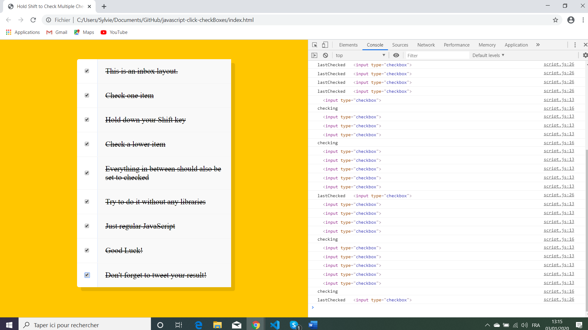

# :zap: Javascript Click Checkboxes

* Wes Bos Youtube Tutorial: [JS Checkbox Challenge! #JavaScript30 10/30](https://www.youtube.com/watch?v=RIPYsKx1iiU&list=PLu8EoSxDXHP6CGK4YVJhL_VWetA865GOH&index=11&t=0s).
* **Note:** to open web links in a new window use: _ctrl+click on link_


## :page_facing_up: Table of contents

* [:zap: Javascript Click Checkboxes](#zap-javascript-click-checkboxes)
  * [:page_facing_up: Table of contents](#page_facing_up-table-of-contents)
  * [:books: General info](#books-general-info)
  * [:camera: Screenshots](#camera-screenshots)
  * [:signal_strength: Technologies](#signal_strength-technologies)
  * [:floppy_disk: Setup](#floppy_disk-setup)
  * [:computer: Code Examples](#computer-code-examples)
  * [:cool: Features](#cool-features)
  * [:clipboard: Status & To-Do List](#clipboard-status--to-do-list)
  * [:clap: Inspiration](#clap-inspiration)
  * [:file_folder: License](#file_folder-license)
  * [:envelope: Contact](#envelope-contact)

## :books: General info

* Tutorial Code using javascript to select/deselect checkboxes.

## :camera: Screenshots

.

## :signal_strength: Technologies

* Ran in Google Chrome browser with: [Javascript engine V8 9.9 for Windows (x64)](https://en.wikipedia.org/wiki/V8_(JavaScript_engine)).

## :floppy_disk: Setup

* Open index.html in browser. If any code is changed the browser needs to be refreshed.

## :computer: Code Examples

* Function to check 'in between' boxes if between selected boxes

```javascript
function handleCheck(e) {
  //check if they had the shift key down
  //AND check that they are checking it
  let inBetween = false;
  if (e.shiftKey && this.checked) {
    //loop over every single checkbox
    checkboxes.forEach(checkbox => {
      console.log(checkbox);
      if (checkbox === this || checkbox === lastChecked){
        inBetween = !inBetween;
        console.log('checking');
      }
      
      if (inBetween) {
        checkbox.checked = true;    
      }
    });
  }
```

## :cool: Features

* Check boxes can be checked/unchecked manually.

## :clipboard: Status & To-Do List

* Status: Working.
* To-Do: Nothing.

## :clap: Inspiration

* Wes Bos Youtube Tutorial: [JS Checkbox Challenge! #JavaScript30 10/30](https://www.youtube.com/watch?v=RIPYsKx1iiU&list=PLu8EoSxDXHP6CGK4YVJhL_VWetA865GOH&index=11&t=0s).

## :file_folder: License

* N/A

## :envelope: Contact

* Repo created by [ABateman](https://github.com/AndrewJBateman), email: gomezbateman@yahoo.com
